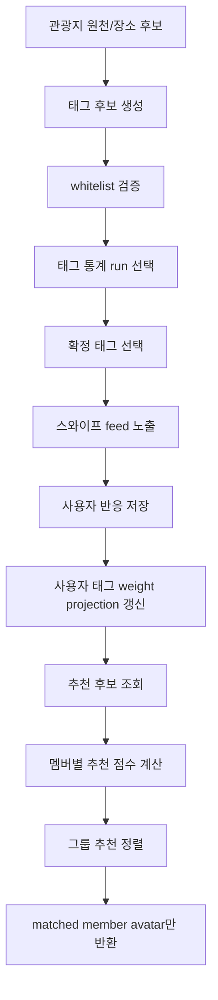
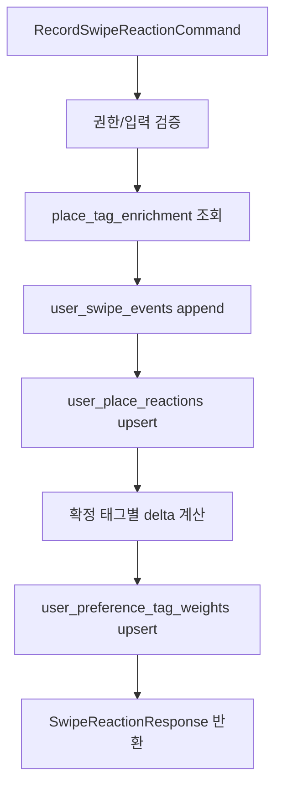

# Recommendation System and Weight Calculation Plan

이 문서는 추천 시스템과 가중치 계산 자동화 도구를 만들기 위한 실행 계획이다.

상태: **구현 및 검증 완료 (2026-06-22)**

다른 에이전트는 이 문서를 입력으로 받으면 구현 전에 반드시 사용자에게 사용자 흐름, 수용 기준, 테스트 계획을 설명하고 OK를 받은 뒤 테스트를 먼저 작성해야 한다.

## 목표

- 고정 태그 whitelist 기반으로 장소 태그를 확정한다.
- 스와이프 반응으로 사용자별 태그 선호도를 누적한다.
- `confidence`, `weight`, `preference_discrimination`을 사용해 추천 점수를 계산한다.
- cold-start에서는 AI 기본값과 50개 페르소나 합성 스와이프 데이터를 사용하고, 실제 사용자 데이터가 충분해지면 실제 이벤트 기반 통계로 전환한다.
- 런타임 추천 API에서는 AI 모델을 호출하지 않는다.
- 다른 멤버의 raw score, normalized score, 태그 가중치, 스와이프 로그를 API/UI/AI context에 노출하지 않는다.

## 담당과 범위

담당자: 민경철

주요 디렉토리:

```text
backend/src/main/java/com/soomgil/common/cqrs/
backend/src/main/java/com/soomgil/place/
backend/src/main/java/com/soomgil/preference/
backend/src/main/java/com/soomgil/social/
backend/src/main/java/com/soomgil/media/
backend/src/main/java/com/soomgil/global/storage/
backend/src/main/resources/tourism-source/
backend/src/main/resources/preference/
```

필수 참조 문서:

```text
.agent/docs/product-specs/preference_tagging_policy.md
.agent/docs/product-specs/tourism_source_policy.md
.agent/docs/process/backend_team_tdd_checklist.md
.agent/contracts/schema.dbml
.agent/contracts/backend_contract_decisions.md
```

## 핵심 데이터

추천 계산은 아래 데이터를 사용한다.

| 데이터 | 책임 |
| :--- | :--- |
| `preference.preference_tags` | 고정 태그 whitelist seed |
| `preference.place_tag_enrichments` | 장소 태깅 실행 단위 |
| `preference.place_tag_enrichment_candidates` | AI/offline tagger가 낸 후보 전체 |
| `preference.place_tag_enrichment_tags` | 추천 serving에 사용할 확정 태그 |
| `preference.tag_statistic_runs` | `AI_ONLY_DEFAULT`, `SYNTHETIC_PERSONA`, `REAL_USER` 통계 run |
| `preference.tag_statistics` | 태그별 `preference_discrimination` |
| `preference.user_swipe_events` | 실제 사용자 스와이프 이벤트 로그 |
| `preference.user_place_reactions` | 사용자-장소 최종 반응 |
| `preference.user_preference_tag_weights` | 사용자별 현재 태그 선호도 projection |
| `preference.synthetic_personas` | 50개 cold-start 페르소나 |
| `preference.synthetic_swipe_events` | 합성 스와이프 이벤트 |
| `place` / `tourism_source` | 후보 장소와 태그 추출 원천 |
| `social.user_follows` | 팔로우 기반 liked member avatar 표시 |

## 불변 규칙

- 태그는 `preference_tagging_policy.md`의 whitelist 안에서만 확정한다.
- whitelist 밖 후보는 확정 태그가 아니라 rejected candidate로만 남긴다.
- 확정 태그는 장소당 최대 10개다.
- 핵심 태그는 상위 3~4개, 보조 태그는 나머지 6~7개다.
- `confidence`가 낮은 후보는 `preference_discrimination`이 높아도 확정하지 않는다.
- cold-start 합성 데이터와 실제 사용자 데이터는 source를 섞지 않는다.
- serving run은 한 번에 하나만 active다.
- 수상작 사진 존재 여부는 추천 점수에 직접 더하지 않는다.
- 수상작 사진은 display 후보일 뿐 scoring feature가 아니다.

## 전체 흐름



## 1. 태그 통계 계산

### 1.1 positive/negative 정의

```text
positive = LIKE 또는 SUPER_LIKE
negative = NOPE
```

### 1.2 전체 긍정률

```text
global_positive_rate =
전체 positive 이벤트 수 / 전체 스와이프 이벤트 수
```

이벤트 수가 0이면 serving run을 만들지 않는다. cold-start 1단계에서는 별도 계산 없이 `preference_discrimination = 0.5`를 사용한다.

### 1.3 태그별 smoothing 긍정률

초기 smoothing 값:

```text
alpha = 100
```

계산:

```text
smoothed_tag_positive_rate =
(tag_positive_count + alpha * global_positive_rate)
/
(tag_reaction_count + alpha)
```

### 1.4 preference_discrimination

```text
distance =
abs(smoothed_tag_positive_rate - global_positive_rate)

preference_discrimination =
distance / max(global_positive_rate, 1 - global_positive_rate)
```

값 범위:

```text
0.0 <= preference_discrimination <= 1.0
```

해석:

- `0`에 가까움: 전체 평균과 반응이 비슷해서 취향을 잘 가르지 못한다.
- `1`에 가까움: 전체 평균과 반응이 크게 달라서 취향을 잘 가른다.

주의:

- 이 값은 "좋아하는 정도"가 아니다.
- 좋아함/싫어함 방향은 사용자별 `preference_score`가 표현한다.
- rarity나 semantic depth로 대체하지 않는다.

## 2. cold-start 통계 run

통계 source는 다음 순서를 따른다.

| 단계 | source | 사용 |
| :--- | :--- | :--- |
| 1 | `AI_ONLY_DEFAULT` | 모든 태그 `preference_discrimination = 0.5` |
| 2 | `SYNTHETIC_PERSONA` | 50개 페르소나 합성 스와이프 이벤트 기반 |
| 3 | `REAL_USER` | 실제 사용자 스와이프 이벤트 기반 |

전환 기준 후보:

```text
전체 실제 스와이프 이벤트 수 >= 10,000
각 핵심 태그별 실제 반응 수 >= 100
또는 서비스 운영자가 승인한 offline evaluation 통과
```

자동화 도구는 `tag_statistic_runs.is_serving = true`인 run을 하나만 허용해야 한다.

## 3. 확정 태그 선택

AI/offline tagger는 후보를 만들 수 있지만, 서버 selector가 whitelist와 점수로 확정한다.

### 3.1 후보 필드

```text
tag_code
confidence
weight
reason
```

범위:

```text
0.0 <= confidence <= 1.0
0.0 <= weight <= 1.0
```

### 3.2 후보 reject

아래 후보는 확정하지 않는다.

- whitelist 밖 tag code
- inactive tag
- `confidence < min_confidence`
- 같은 의미 중복 후보

초기 config:

```text
min_confidence = 0.55
max_confirmed_tags_per_place = 10
primary_tag_count = 3 또는 4
```

`min_confidence`는 운영 config로 빼고, 변경 시 테스트와 metric 비교를 남긴다.

### 3.3 selection_score

```text
selection_score =
confidence * 0.50
+ weight * 0.30
+ preference_discrimination * 0.20
```

선택 순서:

1. whitelist 밖 후보 reject
2. confidence threshold 미만 reject
3. 태그별 최신 serving `preference_discrimination` join
4. `selection_score DESC`
5. `confidence DESC`
6. `weight DESC`
7. `tag_code ASC`
8. 상위 최대 10개 확정

확정 당시 `preference_discrimination`은 `preference_discrimination_snapshot`으로 저장한다.

## 4. 스와이프 반응 저장

### 4.1 reaction weight

```text
SUPER_LIKE = +2.0
LIKE = +1.0
NOPE = -1.0
```

### 4.2 저장 흐름



규칙:

- 이벤트 로그는 append-only다.
- 최종 반응은 `user_place_reactions`에 upsert한다.
- projection은 새 스와이프 이벤트의 reaction을 반영한다.
- V1에서는 시간 감쇠를 사용하지 않는다.
- projection 복구는 원본 이벤트 로그를 재처리해서 수행한다.

## 5. 사용자 태그 weight 계산

### 5.1 tag_importance

```text
tag_importance =
0.7 + 0.3 * preference_discrimination
```

범위:

```text
0.7 <= tag_importance <= 1.0
```

### 5.2 사용자별 태그 근거

```text
place_tag_raw_evidence =
place_tag.confidence * place_tag.weight

place_tag_evidence =
place_tag_raw_evidence
/
sum(place_tag_raw_evidence for the place)
```

업데이트:

```text
positive_evidence += place_tag_evidence if final reaction in (LIKE, SUPER_LIKE)
negative_evidence += place_tag_evidence if final reaction == NOPE
last_reacted_at = now
```

반응이 바뀌면 이전 최종 반응의 근거를 먼저 되돌린 뒤 새 반응의 근거를 적용한다. 이벤트 로그는 모두 남기지만 projection에는 사용자-장소별 최종 반응 한 건만 반영한다.

### 5.3 preference_score

```text
preference_score =
prior-adjusted preference from
positive_evidence and negative_evidence
```

주의:

- `preference_score`는 `0..1` 범위이며 `0.5`가 중립이다.
- 사전 강도와 호불호 반영 방식은 계산 policy version으로 관리한다.
- API와 UI에는 positive/negative evidence와 다른 사용자의 preference score를 노출하지 않는다.

## 6. 추천 점수 계산

### 6.1 후보 풀

기본 후보:

```text
현재 지도 viewport 안의 place
```

필수 query input:

```text
trip_id
request_user_id
bbox
tab
page
size
```

선택 input:

```text
center_lat
center_lng
route_anchor
content_type
region
```

### 6.2 멤버별 장소 점수

```text
member_place_score =
sum(
  user_preference_tag_weights.preference_score
  * normalized_place_tag_evidence
)
```

join 기준:

```text
user_preference_tag_weights.tag_id = place_tag.tag_id
```

`normalized_place_tag_evidence`는 같은 장소의 확정 태그별 `confidence * weight`를 합이 1이 되도록 정규화한 값이다. `preference_discrimination`은 사용자 preference의 사전 강도 계산에 사용하며 장소 점수에 다시 더하지 않는다.

### 6.3 그룹 점수

```text
group_recommendation_score =
sum(member_place_score for each active trip member)
```

정렬:

```text
group_recommendation_score DESC
distance_score DESC 또는 distance ASC
place_popularity DESC
place_id ASC
```

주의:

- 멤버별 raw/normalized score는 반환하지 않는다.
- 카드에는 matched member avatar/id/name 수준만 반환한다.

### 6.4 matched member

초기 config:

```text
matched_member_threshold = 0.15
```

```text
matched_member =
member_place_score >= matched_member_threshold
또는 SUPER_LIKE tab에서 해당 장소를 SUPER_LIKE한 멤버
```

응답에는 다음 정도만 포함한다.

```text
member_id
display_name
avatar_url
```

## 7. SUPER_LIKE tab

`SUPER_LIKE` 탭은 추천 점수보다 저장/강한 선호를 우선한다.

후보:

```text
trip active members가 SUPER_LIKE한 place
```

정렬 후보:

```text
super_like_count DESC
sum_super_like_tag_match_score DESC
latest_super_liked_at DESC
distance ASC
place_id ASC
```

`SUPER_LIKE`는 다른 사용자에게 추천한다는 뜻이 아니라 본인의 강한 선호다.

## 8. 팔로우 기반 신호

스와이프 feed나 추천 카드에서 팔로우한 사용자의 반응을 표시할 수 있다.

허용:

```text
내가 팔로우하는 사용자 중 이 장소를 LIKE/SUPER_LIKE한 사용자 avatar 표시
```

금지:

```text
팔로우 사용자의 raw score 노출
팔로우 사용자의 normalized score 노출
팔로우 사용자의 태그별 가중치 노출
팔로우 사용자의 스와이프 로그 노출
```

## 9. 50개 페르소나 합성 스와이프

페르소나는 정확히 50개여야 한다.

필드:

```text
persona_id
display_name
description
hard_like_tags
hard_dislike_tags
soft_like_tags
soft_dislike_tags
neutral_tags
reaction_thresholds
noise_rate
seed
```

규칙:

- hard like/dislike는 절대 위반하지 않는다.
- soft preference에는 noise를 허용하지만 `noise_rate <= 0.05`다.
- 같은 `persona_id`, place, seed 조합은 항상 같은 반응을 생성한다.
- 모든 합성 이벤트에 `source = SYNTHETIC_PERSONA`, `persona_id`, generator version을 남긴다.

### 9.1 persona_place_score

```text
persona_place_score =
sum(
  persona_tag_preference[tag_code]
  * place_tag.confidence
  * place_tag.weight
)
```

초기 threshold:

```text
persona_place_score >= 1.20 -> SUPER_LIKE
persona_place_score >= 0.35 -> LIKE
persona_place_score <= -0.35 -> NOPE
그 외 -> 페르소나별 neutral 정책
```

합성 데이터 품질 검사:

```text
persona count = 50
hard_like/hard_dislike violation = 0
각 페르소나 최소 스와이프 수 충족
각 핵심 태그 최소 반응 수 충족
같은 seed 재실행 결과 동일
```

품질 검사를 통과하지 못하면 `SYNTHETIC_PERSONA` 통계 run을 serving으로 승격하지 않는다.

## 10. 구현 단위

자동화 도구는 아래 순서로 테스트와 구현을 만든다.

### 10.1 domain/policy

```text
backend/src/main/java/com/soomgil/preference/domain/policy/PreferenceDiscriminationCalculator.java
backend/src/main/java/com/soomgil/preference/domain/policy/PlaceTagSelector.java
backend/src/main/java/com/soomgil/preference/domain/policy/UserPreferenceWeightCalculator.java
backend/src/main/java/com/soomgil/preference/domain/policy/RecommendationScorer.java
backend/src/main/java/com/soomgil/preference/domain/policy/SyntheticPersonaSwipeGenerator.java
```

### 10.2 command/query

```text
UpsertSwipeReactionCommand
UpsertSwipeReactionCommandHandler
RecalculateTagStatisticsCommand
RecalculateTagStatisticsHandler
GenerateSyntheticPersonaSwipesCommand
GenerateSyntheticPersonaSwipesHandler
SwipeFeedQuery
ListPlaceRecommendationsQuery
PlaceViewportCandidateQuery
```

### 10.3 persistence

```text
PreferencePlaceTagEnrichmentMapper
PreferenceSwipeReactionMapper
PreferenceTagStatisticsMapper
PreferenceSyntheticPersonaMapper
PreferenceRecommendationMapper
PreferenceSwipeFeedMapper
PreferenceSavedPlaceMapper
```

MyBatis XML:

```text
backend/src/main/resources/mappers/preference/PreferencePlaceTagEnrichmentMapper.xml
backend/src/main/resources/mappers/preference/PreferenceSwipeReactionMapper.xml
backend/src/main/resources/mappers/preference/PreferenceTagStatisticsMapper.xml
backend/src/main/resources/mappers/preference/PreferenceSyntheticPersonaMapper.xml
backend/src/main/resources/mappers/preference/PreferenceRecommendationMapper.xml
backend/src/main/resources/mappers/preference/PreferenceSwipeFeedMapper.xml
backend/src/main/resources/mappers/preference/PreferenceSavedPlaceMapper.xml
```

### 10.4 config

초기 설정값은 config로 분리한다.

```text
soomgil.preference.statistics.alpha = 100
soomgil.preference.tag-selection.minimum-confidence = 0.55
soomgil.preference.tag-selection.maximum-confirmed-tags = 10
soomgil.preference.recommendation.matched-member-threshold = 0.15
soomgil.preference.synthetic-persona.required-count = 50
soomgil.preference.synthetic-persona.maximum-noise-rate = 0.05
```

## 11. TDD 테스트 계획

구현 전 아래 테스트를 먼저 작성한다.

### 11.1 계산 단위 테스트

- `preference_discrimination` smoothing 계산
- 표본 수가 작은 태그가 과대평가되지 않는지
- `tag_importance = 0.7 + 0.3 * preference_discrimination`
- 장소별 태그 근거 합이 1인지
- positive/negative evidence 기반 `preference_score`
- 추천 점수 합산
- group score 합산
- matched member threshold

### 11.2 태그 선택 테스트

- whitelist 밖 후보 reject
- inactive tag reject
- 낮은 confidence 후보 reject
- `selection_score` 정렬
- 장소당 최대 10개 확정
- 확정 당시 `preference_discrimination_snapshot` 저장

### 11.3 스와이프 테스트

- `user_swipe_events` append
- `user_place_reactions` upsert
- 확정 태그만 projection 반영
- `SUPER_LIKE`, `LIKE`, `NOPE` delta 차이
- 반응 변경 시 이전 근거를 되돌리고 최종 반응만 projection에 반영

### 11.4 추천 query 테스트

- viewport 밖 후보 제외
- trip active member만 group score 반영
- positive/negative evidence와 다른 사용자의 preference score 미노출
- matched member avatar만 반환
- SUPER_LIKE tab 정렬
- follower liked avatar 표시

### 11.5 synthetic persona 테스트

- active persona 수 정확히 50개
- hard like/dislike 위반 0개
- 같은 seed 재실행 결과 동일
- noise rate 0.05 이하
- 품질 검사 실패 시 serving 승격 금지

### 11.6 source 분리 테스트

- `AI_ONLY_DEFAULT`, `SYNTHETIC_PERSONA`, `REAL_USER` serving run이 섞이지 않는다.
- 실제 사용자 전환 후 synthetic 통계가 serving score에 들어가지 않는다.

## 12. 수용 기준

- 모든 공식은 단위 테스트로 검증된다.
- whitelist 밖 태그는 확정 태그에 저장되지 않는다.
- 스와이프 저장 후 사용자 preference projection이 갱신된다.
- 추천 API는 group score 순으로 후보를 반환한다.
- 추천 API는 matched member avatar 수준만 반환한다.
- 런타임 추천 API에서 AI 모델 호출이 없다.
- synthetic persona 데이터는 실제 사용자 이벤트와 분리된다.
- 수상작 사진 존재 여부가 추천 점수에 직접 영향을 주지 않는다.
- 관련 backend test가 통과한다.

## 13. 자동화 에이전트 작업 지시

자동화 에이전트는 다음 순서로만 진행한다.

1. 이 문서와 필수 참조 문서를 읽는다.
2. 사용자에게 추천/스와이프/가중치 사용자 흐름을 설명한다.
3. 수용 기준과 테스트 계획을 설명하고 OK를 받는다.
4. 테스트 파일을 먼저 만든다.
5. 테스트 실패를 확인한다.
6. domain/policy 계산 구현을 먼저 한다.
7. command/query handler를 구현한다.
8. MyBatis mapper/repository를 구현한다.
9. controller를 연결한다.
10. migration/seed가 필요하면 추가한다.
11. 관련 테스트와 전체 backend test를 실행한다.
12. 결과와 남은 위험을 보고한다.
13. 커밋한다.

중간에 정책과 충돌하면 구현을 멈추고 사용자에게 질문한다.

## 14. 금지 사항

- 런타임 추천 API에서 AI를 매번 호출하지 않는다.
- rarity만으로 태그 중요도를 정하지 않는다.
- semantic depth/tree depth를 MVP 추천 점수 필수 입력으로 쓰지 않는다.
- whitelist 밖 태그를 확정 태그로 저장하지 않는다.
- 합성 이벤트와 실제 사용자 이벤트를 source 구분 없이 섞지 않는다.
- 다른 멤버의 raw score, normalized score, tag weight, swipe log를 노출하지 않는다.
- 검증되지 않은 uplift 숫자를 문서, 발표, API 응답에 넣지 않는다.
- 수상작 사진 존재 여부를 추천 점수에 직접 가산하지 않는다.

## 15. 검증 명령

```bash
JAVA_HOME=/opt/homebrew/opt/openjdk@21 ./gradlew test
npm --prefix .agent run harness:check
```

## 진행 로그

- [x] 사용자 흐름 설명
- [x] 테스트 계획 설명
- [x] OK 확인
- [x] 테스트 작성
- [x] 실패 확인
- [x] 계산 policy 구현
- [x] command/query 구현
- [x] persistence 구현
- [x] API 연결
- [x] migration/seed 반영
- [x] 검증
- [x] 커밋

### 2026-06-22 완료 근거

- `preference_discrimination`을 smoothing 긍정률과 전체 긍정률의 정규화 거리로 교정하고 `0..1` 경계를 테스트했다.
- `tag_importance = 0.7 + 0.3 * preference_discrimination` 계산 정책과 테스트를 추가했다.
- `SUPER_LIKE`가 `LIKE`의 2배 positive evidence를 반영하고 반응 변경 시 이전 2배 근거를 정확히 되돌리도록 통합 테스트했다.
- `matched_member_threshold = 0.15`를 멤버 장소 점수에 직접 적용하도록 config와 scorer를 일치시켰다.
- REAL_USER 통계는 append-only `user_swipe_events`, projection은 최종 `user_place_reactions`을 사용하도록 source 책임을 분리했다.
- SUPER_LIKE 탭은 `super_like_count`, 슈퍼라이크 멤버의 태그 매칭 합, 최신 반응, 거리 순으로 정렬한다.
- 합성 이벤트에 `source = SYNTHETIC_PERSONA`를 DB 제약으로 고정하는 Flyway V37을 추가했다.
- 50개 페르소나, 결정적 재실행, hard preference 보호, noise 상한, source 승격 차단 테스트가 통과했다.
- 런타임 추천 코드에 AI client, 수상작 사진, rarity, semantic/tree depth 의존성이 없음을 정적 검사했다.
- 추천 API DTO에 raw/normalized score, evidence, tag weight, swipe log가 없음을 정적 검사했다.
- `./gradlew test --rerun-tasks --no-daemon`, `npm --prefix .agent run harness:check`, 로컬 Flyway V37, 서울·대전 seed 재실행이 통과했다.

## 결정 기록

- 2026-06-15: 추천 점수는 `confidence`, `weight`, `preference_discrimination` 중심으로 계산한다.
- 2026-06-15: `rarity`, `semantic_specificity`, tree depth는 MVP 추천 점수 필수 입력에서 제외한다.
- 2026-06-15: cold-start는 50개 고정 페르소나 합성 스와이프를 사용하되 실제 사용자 serving 통계와 섞지 않는다.
- 2026-06-22: REAL_USER 통계 source는 append-only 스와이프 이벤트이며 사용자 projection만 장소별 최종 반응을 사용한다.
- 2026-06-22: SUPER_LIKE positive evidence는 LIKE의 2배이고, 탭 동점 점수는 슈퍼라이크한 멤버만 합산한다.

## 후속 작업

- 서비스 전체 release checklist가 생기면 이 plan의 backend 추천 완료 조건과 연결한다.
- 실제 사용자 데이터가 확보되면 baseline 대비 uplift metric을 별도 evaluation 문서로 남긴다.
