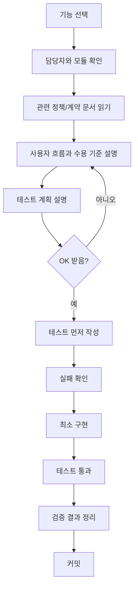

# Backend Team TDD Checklist

이 문서는 숨길 backend 3인 개발의 최우선 작업 보드다.

기능을 시작하기 전에는 이 문서에서 담당자, 디렉토리, 의존 모듈, 테스트 순서를 먼저 확인한다. 구현은 항상 이해 설명, 테스트 작성, 실패 확인, 구현, 테스트 통과 순서로 진행한다.

## 핵심 규칙

- 공통 규칙은 3명이 같이 정한다.
- 실제 코드는 가능한 한 자기 담당 디렉토리 안에서만 수정한다.
- 남의 모듈이 필요하면 직접 DB나 mapper를 만지지 않고 담당자가 연 command/query interface를 호출한다.
- 공통 파일, controller, DTO, migration, DBML, OpenAPI는 merge conflict가 잘 나므로 동시에 수정하지 않는다.
- 기능 개발 전에는 사용자 흐름과 테스트 계획을 설명하고 OK를 받은 뒤 테스트를 먼저 작성한다.
- 테스트가 실패하는 이유를 확인한 뒤 구현한다.
- 구현 완료는 테스트 통과와 커밋까지 포함한다.

## 개발 흐름



## 기능별 필수 체크리스트

모든 기능은 아래 항목을 완료해야 한다.

- [ ] 담당자와 담당 디렉토리를 확인했다.
- [ ] 관련 문서를 읽었다.
- [ ] 사용자 흐름을 설명했다.
- [ ] 수용 기준을 설명했다.
- [ ] 정상/실패/권한/경계 테스트 계획을 설명했다.
- [ ] OK를 받았다.
- [ ] 테스트를 먼저 작성했다.
- [ ] 테스트 실패를 확인했다.
- [ ] 테스트를 통과시키는 최소 구현을 했다.
- [ ] 전체 관련 테스트를 실행했다.
- [ ] 변경 범위와 남은 위험을 정리했다.
- [ ] 커밋했다.

## 공통 합의 항목

공통은 3명이 같이 정하되, 파일 소유 주도자는 아래처럼 둔다.

| 항목 | 디렉토리 | 주도 | 사용 |
| :--- | :--- | :--- | :--- |
| CQRS 기본 타입 | `backend/src/main/java/com/soomgil/common/cqrs/` | 민경철 | 모든 command/query |
| 공통 API DTO | `backend/src/main/java/com/soomgil/common/api/dto/` | 3명 합의 | 모든 controller |
| Pagination | `backend/src/main/java/com/soomgil/common/pagination/` | 3명 합의 | 모든 list API |
| 공통 error | `backend/src/main/java/com/soomgil/global/error/` | 윤정 | 모든 실패 응답 |
| 현재 사용자/security | `backend/src/main/java/com/soomgil/global/security/` | 윤정 | 모든 인증 API |
| 공통 event envelope | `backend/src/main/java/com/soomgil/global/event/` | 김지훈 | 협업/실시간 이벤트 |
| S3/storage 기본 계약 | `backend/src/main/java/com/soomgil/global/storage/` | 민경철 | 이미지/미디어 |

공통 합의 TODO:

- [ ] `Command`, `CommandHandler`, `Query`, `QueryHandler` 형태 확정
- [ ] command/query/handler 이름 규칙 확정
- [ ] handler return type 규칙 확정
- [ ] `CurrentUser` 표현 확정
- [ ] 공통 `ErrorCode`, `BusinessException`, `ProblemDetails` 규칙 확정
- [ ] page response 규칙 확정
- [ ] 권한 실패와 validation 실패 응답 규칙 확정
- [ ] 공통 event envelope 필드 확정
- [ ] storage object key/public URL 규칙 확정

## 담당자별 소유 범위

### 윤정

주요 책임:

- AI chat
- tool calling
- auth/user/security
- 공통 error
- 여행방 사용자 채팅
- note/checklist tool surface

주요 디렉토리:

```text
backend/src/main/java/com/soomgil/ai/
backend/src/main/java/com/soomgil/chat/
backend/src/main/java/com/soomgil/auth/
backend/src/main/java/com/soomgil/user/
backend/src/main/java/com/soomgil/global/security/
backend/src/main/java/com/soomgil/global/error/
backend/src/main/java/com/soomgil/planning/
```

윤정 TODO:

- [ ] `auth` 로그인/토큰/세션 최소 흐름 테스트 계획
- [ ] `user` 현재 사용자 조회 테스트 계획
- [ ] `global/security` 인증 context 테스트 계획
- [ ] `global/error` Problem Details 응답 테스트 계획
- [ ] `ai` session/message 저장 테스트 계획
- [ ] `ai` tool registry 테스트 계획
- [ ] `ai` tool 실행 audit log 테스트 계획
- [ ] `ai` context 권한 제한 테스트 계획
- [ ] `chat` 여행방 채팅 메시지 테스트 계획
- [ ] `planning` note/checklist tool 호출 테스트 계획

의존 규칙:

- AI tool은 `itinerary`, `preference`, `place` DB를 직접 수정하거나 조회하지 않는다.
- AI tool write는 담당 모듈의 command interface를 호출한다. 예: itinerary는 김지훈, planning note/checklist는 윤정, collaboration/undo envelope은 김지훈.
- AI place/recommendation read tool은 민경철의 place/preference query interface를 호출한다.
- AI context에는 다른 멤버의 raw preference score, tag weight, swipe log를 넣지 않는다.

### 김지훈

주요 책임:

- trip
- itinerary
- map drawing
- route matching
- collaboration
- undo/redo
- WebSocket event
- geo/Mapbox

주요 디렉토리:

```text
backend/src/main/java/com/soomgil/trip/
backend/src/main/java/com/soomgil/itinerary/
backend/src/main/java/com/soomgil/collaboration/
backend/src/main/java/com/soomgil/geo/
backend/src/main/java/com/soomgil/global/event/
```

김지훈 TODO:

- [ ] `trip` 여행방 생성/멤버/권한 테스트 계획
- [ ] `trip` invite/link/code 테스트 계획
- [ ] `itinerary` day/item 추가 테스트 계획
- [ ] `itinerary` item 이동/재정렬 테스트 계획
- [ ] `itinerary` "일차 미정" 테스트 계획
- [ ] `itinerary` version 증가 테스트 계획
- [ ] `itinerary` map drawing 저장 테스트 계획
- [ ] `itinerary` route segment 저장 테스트 계획
- [ ] `itinerary` Mapbox map matching 성공/실패 테스트 계획
- [ ] `collaboration` undo/redo stack 테스트 계획
- [ ] `collaboration` WebSocket event broadcast 테스트 계획
- [ ] `geo` legal region/viewport/coordinate 테스트 계획

의존 규칙:

- 지도 추천 패널은 preference DB를 직접 읽지 않고 민경철의 recommendation query를 호출한다.
- Mapbox 실패 시 원본 stroke나 부분 snapped route를 저장하지 않는다.
- 저장 전 drawing preview는 영구 저장하지 않는다.
- itinerary write는 version, 권한, event, undo/redo를 함께 고려한다.

### 민경철

주요 책임:

- CQRS interface
- place
- tourism source
- preference
- swipe
- recommendation
- social follower signal
- S3 이미지 후보

주요 디렉토리:

```text
backend/src/main/java/com/soomgil/common/cqrs/
backend/src/main/java/com/soomgil/place/
backend/src/main/java/com/soomgil/preference/
backend/src/main/java/com/soomgil/social/
backend/src/main/java/com/soomgil/global/storage/
backend/src/main/resources/tourism-source/
backend/src/main/resources/preference/
```

민경철 TODO:

- [ ] `common/cqrs` Command/Query/Handler 테스트 또는 compile contract 확인
- [ ] `place` 관광지 조회/detail 테스트 계획
- [ ] `place` viewport 후보 조회 테스트 계획
- [ ] `place` 일반 이미지 + 수상작 이미지 후보 테스트 계획
- [ ] `tourism_source` 원천 import manifest 테스트 계획
- [ ] `tourism_source` 수상작 사진 매칭 테스트 계획
- [ ] `preference` 고정 태그 whitelist seed 테스트 계획
- [ ] `preference` tag enrichment 후보/확정 테스트 계획
- [ ] `preference` swipe feed 테스트 계획
- [ ] `preference` swipe reaction 저장 테스트 계획
- [ ] `preference` user preference projection 테스트 계획
- [ ] `preference` recommendation score 테스트 계획
- [ ] `social` follower reaction lookup 테스트 계획
- [ ] `global/storage` S3 object metadata 테스트 계획

의존 규칙:

- 추천은 trip 권한/멤버십을 직접 판단하지 않고 김지훈의 trip access query를 호출한다.
- 추천은 runtime마다 AI를 호출하지 않는다.
- whitelist 밖 태그는 확정 태그로 저장하지 않는다.
- 수상작 사진 존재 여부를 추천 점수에 직접 더하지 않는다.
- `UNMATCHED`, `CANDIDATE`, `AMBIGUOUS` 수상작 사진은 public serving 후보에서 제외한다.

## 후순위 모듈

아래 모듈은 1차 핵심 흐름 이후 시작한다. 시작 전에도 동일한 TDD 흐름을 따른다.

| 모듈 | 디렉토리 | 임시 주도 | 시작 조건 |
| :--- | :--- | :--- | :--- |
| media | `backend/src/main/java/com/soomgil/media/` | 민경철 | storage 계약 확정 후 |
| record | `backend/src/main/java/com/soomgil/record/` | 김지훈 | trip/itinerary/place 참조 안정화 후 |
| community | `backend/src/main/java/com/soomgil/community/` | 윤정 | auth/user/media/trip snapshot 안정화 후 |
| notification | `backend/src/main/java/com/soomgil/notification/` | 윤정 | auth/user/trip invite 흐름 안정화 후 |

후순위 TODO:

- [ ] `media` upload URL/file metadata 테스트 계획
- [ ] `record` trip record entry/media 테스트 계획
- [ ] `community` post/snapshot/comment/report 테스트 계획
- [ ] `notification` trip invite notification 테스트 계획

## Merge Conflict 방지 규칙

- [ ] 한 PR은 가능한 한 한 사람의 담당 디렉토리만 수정한다.
- [ ] 공통 파일 변경은 별도 PR로 먼저 합의한다.
- [ ] 같은 controller를 2명이 동시에 수정하지 않는다.
- [ ] 같은 DTO를 2명이 동시에 수정하지 않는다.
- [ ] 같은 mapper XML을 2명이 동시에 수정하지 않는다.
- [ ] Flyway migration 번호는 작업 시작 전에 예약한다.
- [ ] DBML/OpenAPI는 동시에 수정하지 않는다.
- [ ] submodule pointer 변경은 관련 backend commit이 push된 뒤 orchestration repo에서 따로 커밋한다.

## 기능 카드 템플릿

새 기능은 아래 템플릿으로 체크리스트를 만든다.

```text
## [담당자] 기능명

모듈:
디렉토리:
관련 문서:
의존 interface:

이해/설명:
- [ ] 사용자 흐름 설명
- [ ] 수용 기준 설명
- [ ] 실패/권한/경계 조건 설명
- [ ] OK 받음

테스트:
- [ ] 정상 흐름 테스트 작성
- [ ] 실패 흐름 테스트 작성
- [ ] 권한 테스트 작성
- [ ] 경계 조건 테스트 작성
- [ ] 테스트 실패 확인

구현:
- [ ] command/query/interface 구현
- [ ] domain/policy 구현
- [ ] mapper/repository 구현
- [ ] controller 연결
- [ ] migration 작성

검증:
- [ ] 관련 테스트 통과
- [ ] 전체 backend test 통과
- [ ] 변경 요약 작성
- [ ] 커밋
```
