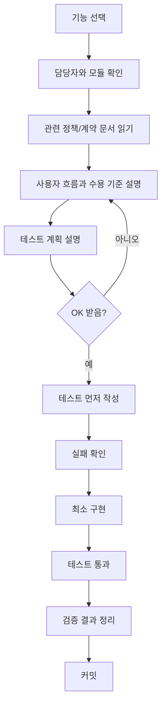

# Backend Team TDD Checklist

이 문서는 숨길 backend 3인 개발의 최우선 작업 보드다.

기능을 시작하기 전에는 이 문서에서 담당자, 디렉토리, 의존 모듈, 테스트 순서를 먼저 확인한다. 구현은 항상 이해 설명, 테스트 작성, 실패 확인, 구현, 테스트 통과 순서로 진행한다.

## 문서 범위와 완료 의미

이 문서가 모두 체크됐다는 뜻은 "backend 담당 범위의 기능 개발이 완료됐다"는 뜻이다.

이 문서만 모두 체크됐다고 해서 숨길 서비스 전체 개발이 완료됐다고 말하지 않는다. 서비스 전체 완료는 backend 외에도 frontend, API 연동, E2E, 배포, 운영 설정, 최종 QA가 모두 끝났을 때만 말한다.

서비스 전체 완료 판단에는 최소한 아래 항목이 추가로 필요하다.

- frontend 화면/상태/라우팅 구현 완료
- frontend와 backend API 연동 완료
- 인증, 지도, 추천, AI tool calling의 주요 E2E 시나리오 통과
- Docker/local 협업 환경 검증 완료
- 배포 환경 설정과 secret/config 분리 완료
- smoke test, regression test, 최종 QA 통과
- main/develop 통합과 submodule pointer 정리 완료

따라서 이 문서의 모든 담당자별 TODO가 체크되면 "backend 기능 개발 완료"라고 부른다. "서비스 개발 완료"라고 부르려면 별도의 서비스 전체 release checklist가 필요하다.

## 핵심 규칙

- 공통 규칙은 3명이 같이 정한다.
- 실제 코드는 가능한 한 자기 담당 디렉토리 안에서만 수정한다.
- 남의 모듈이 필요하면 직접 DB나 mapper를 만지지 않고 담당자가 연 command/query interface를 호출한다.
- 공통 파일, controller, DTO, migration, DBML, OpenAPI는 merge conflict가 잘 나므로 동시에 수정하지 않는다.
- 기능 개발 전에는 사용자 흐름과 테스트 계획을 설명하고 OK를 받은 뒤 테스트를 먼저 작성한다.
- 테스트가 실패하는 이유를 확인한 뒤 구현한다.
- 구현 완료는 테스트 통과와 커밋까지 포함한다.
- 새 public 계약 타입은 `javadoc_policy.md`에 따라 한국어 JavaDoc을 작성한다.
- 이 문서의 담당자별 TODO 체크박스는 "계획 완료"가 아니라 "기능 개발 완료"를 뜻한다.
- 모든 담당자별 TODO가 체크됐다는 것은 backend 기능 개발이 실제로 완료됐다는 뜻이어야 한다.
- 서비스 전체 완료 여부를 이 문서 하나로 판단하지 않는다.

## 체크박스 완료 기준

담당자별 TODO와 기능 카드의 최종 검증 체크박스는 아래 조건을 모두 만족할 때만 체크한다.

- 사용자 흐름과 수용 기준을 설명했다.
- 테스트 계획을 설명하고 OK를 받았다.
- 테스트를 먼저 작성했다.
- 테스트 실패를 확인했다.
- 구현을 완료했다.
- 관련 테스트가 통과했다.
- 필요한 migration, mapper, controller, 문서 반영이 끝났다.
- 새 public 계약 타입의 한국어 JavaDoc 반영이 끝났다.
- 변경 사항을 커밋했다.

테스트 계획만 세웠거나 interface만 만든 상태는 기능 완료가 아니다. 그런 중간 상태는 기능 카드 안의 "이해/설명" 또는 "테스트" 항목에만 표시하고, 담당자별 TODO는 체크하지 않는다.

완료 근거는 기능 카드, PR 본문, 또는 커밋 메시지/해시로 추적 가능해야 한다.

## 다음 작업 안내 규칙

누군가 본인 이름을 대고 "이제 뭐해야 해?"라고 물으면 이 문서를 기준으로 답한다.

예:

```text
윤정 이제 뭐해야 해?
김지훈 이제 뭐해야 해?
민경철 이제 뭐해야 해?
```

응답 순서:

1. 해당 담당자의 담당 디렉토리와 TODO에서 아직 체크되지 않은 첫 번째 작업을 찾는다.
2. 그 작업의 관련 문서와 의존 interface를 알려준다.
3. 바로 구현하라고 하지 말고, 먼저 사용자 흐름/수용 기준/테스트 계획을 작성하라고 안내한다.
4. 필요한 경우 다른 담당자에게 받아야 하는 interface를 명시한다.
5. 이미 담당자 TODO가 모두 끝났으면 후순위 모듈 또는 통합 테스트에서 다음 작업을 찾는다.

응답 형식:

```text
다음 작업:
담당 디렉토리:
먼저 읽을 문서:
의존하는 interface:
TDD 순서:
1. 이해/설명
2. 테스트 작성
3. 실패 확인
4. 구현
5. 테스트 통과
6. 커밋
```

## 개발 흐름



## 기능별 필수 체크리스트

모든 기능은 아래 항목을 완료해야 한다.

- [ ] 담당자와 담당 디렉토리를 확인했다.
- [ ] 관련 문서를 읽었다.
- [ ] 사용자 흐름을 설명했다.
- [ ] 수용 기준을 설명했다.
- [ ] 정상/실패/권한/경계 테스트 계획을 설명했다.
- [ ] OK를 받았다.
- [ ] 테스트를 먼저 작성했다.
- [ ] 테스트 실패를 확인했다.
- [ ] 테스트를 통과시키는 최소 구현을 했다.
- [ ] 새 public 계약 타입에 한국어 JavaDoc을 작성했다.
- [ ] 전체 관련 테스트를 실행했다.
- [ ] 변경 범위와 남은 위험을 정리했다.
- [ ] 커밋했다.

## 공통 합의 항목

공통은 3명이 같이 정하되, 파일 소유 주도자는 아래처럼 둔다.

| 항목 | 디렉토리 | 주도 | 사용 |
| :--- | :--- | :--- | :--- |
| CQRS 기본 타입 | `backend/src/main/java/com/soomgil/common/cqrs/` | 민경철 | 모든 command/query |
| 공통 API DTO | `backend/src/main/java/com/soomgil/common/api/dto/` | 3명 합의 | 모든 controller |
| Pagination | `backend/src/main/java/com/soomgil/common/pagination/` | 3명 합의 | 모든 list API |
| 공통 error | `backend/src/main/java/com/soomgil/global/error/` | 윤정 | 모든 실패 응답 |
| 현재 인증 사용자/security | `backend/src/main/java/com/soomgil/global/security/` | 윤정 | 모든 인증 API |
| 공통 event envelope | `backend/src/main/java/com/soomgil/global/event/` | 김지훈 | 협업/실시간 이벤트 |
| S3/storage 기본 계약 | `backend/src/main/java/com/soomgil/global/storage/` | 민경철 | 이미지/미디어 |

## 전체 모듈 소유권

아래 표는 backend Java 최상위 디렉토리와 DBML source namespace를 빠짐없이 배정한 기준이다.

| 모듈/namespace | 디렉토리 또는 영역 | 담당 | 범위 |
| :--- | :--- | :--- | :--- |
| `ai` | `backend/src/main/java/com/soomgil/ai/` | 윤정 | AI chat session/message, tool registry, tool call audit |
| `auth` | `backend/src/main/java/com/soomgil/auth/` | 윤정 | 로그인, 토큰, OAuth, 세션, 인증 identity |
| `chat` | `backend/src/main/java/com/soomgil/chat/` | 윤정 | 여행방 사용자 채팅 |
| `collaboration` | `backend/src/main/java/com/soomgil/collaboration/` | 김지훈 | version, undo/redo, 협업 command event |
| `common` | `backend/src/main/java/com/soomgil/common/` | 3명 합의 | CQRS, API DTO, pagination, id/time/validation |
| `community` | `backend/src/main/java/com/soomgil/community/` | 윤정 | 공개 게시글, 댓글, 신고, moderation, retrip surface |
| `geo` | `backend/src/main/java/com/soomgil/geo/` | 김지훈 | 법정동, 좌표, viewport, 지도 지역 조회 |
| `global` | `backend/src/main/java/com/soomgil/global/` | 3명 분담 | error/security/event/storage/config/web/persistence |
| `itinerary` | `backend/src/main/java/com/soomgil/itinerary/` | 김지훈 | 일정 day/item, 일차 미정, route, map drawing, Mapbox |
| `media` | `backend/src/main/java/com/soomgil/media/` | 민경철 | upload URL, media metadata, S3 연동 surface |
| `notification` | `backend/src/main/java/com/soomgil/notification/` | 윤정 | 알림, 여행방 초대 알림 |
| `place` | `backend/src/main/java/com/soomgil/place/` | 민경철 | 장소 조회, 상세, viewport 후보, 이미지 후보 |
| `planning` | `backend/src/main/java/com/soomgil/planning/` | 윤정 | 메모, 체크리스트, AI tool surface |
| `preference` | `backend/src/main/java/com/soomgil/preference/` | 민경철 | 태그, 스와이프, projection, 추천 점수 |
| `record` | `backend/src/main/java/com/soomgil/record/` | 김지훈 | 여행 기록, 기록 미디어 연결 |
| `social` | `backend/src/main/java/com/soomgil/social/` | 민경철 | 팔로우 관계, 팔로우 기반 반응 조회 |
| `trip` | `backend/src/main/java/com/soomgil/trip/` | 김지훈 | 여행방, 멤버, 초대, 권한 |
| `user` | `backend/src/main/java/com/soomgil/user/` | 윤정 | user profile, summary, avatar, settings |
| `tourism_source` | `.agent/contracts/schema.dbml`, `backend/src/main/resources/tourism-source/` | 민경철 | 관광공사 원천, 수상작 사진, source import/matching |
| `ops` | `.agent/contracts/schema.dbml`의 `ops.*` | 윤정 | 운영/audit log 정책. 각 모듈은 자기 이벤트를 남긴다. |

`auth`와 `user`는 책임을 분리하되 윤정이 함께 담당한다.

- 윤정: 현재 로그인한 사용자를 식별하는 인증/session/security 흐름
- 윤정: 식별된 `userId`로 조회하는 profile, avatar, summary, settings

공통 합의 TODO:

- [ ] `Command`, `CommandHandler`, `Query`, `QueryHandler` 형태 확정 및 compile/test 통과
- [ ] command/query/handler 이름 규칙 확정 및 예시 적용
- [ ] handler return type 규칙 확정 및 예시 적용
- [ ] `CurrentUser` 표현 확정 및 인증 테스트 통과
- [ ] 공통 `ErrorCode`, `BusinessException`, `ProblemDetails` 규칙 확정 및 실패 응답 테스트 통과
- [ ] page response 규칙 확정 및 list API 예시 테스트 통과
- [ ] 권한 실패와 validation 실패 응답 규칙 확정 및 테스트 통과
- [ ] 공통 event envelope 필드 확정 및 협업 이벤트 예시 테스트 통과
- [ ] storage object key/public URL 규칙 확정 및 storage metadata 테스트 통과

## 담당자별 소유 범위

### 윤정

주요 책임:

- AI chat
- tool calling
- auth/security/current user identity
- user profile/summary/avatar/settings
- 공통 error
- 여행방 사용자 채팅
- note/checklist tool surface
- community
- notification

주요 디렉토리:

```text
backend/src/main/java/com/soomgil/ai/
backend/src/main/java/com/soomgil/chat/
backend/src/main/java/com/soomgil/auth/
backend/src/main/java/com/soomgil/user/
backend/src/main/java/com/soomgil/global/security/
backend/src/main/java/com/soomgil/global/error/
backend/src/main/java/com/soomgil/planning/
backend/src/main/java/com/soomgil/community/
backend/src/main/java/com/soomgil/notification/
```

윤정 TODO:

- [ ] `auth` 로그인/토큰/세션 최소 흐름 개발 완료
- [ ] `user` profile/summary/avatar/settings 개발 완료
- [ ] `global/security` 인증 context 개발 완료
- [ ] `global/error` Problem Details 응답 개발 완료
- [ ] `ai` session/message 저장 개발 완료
- [ ] `ai` tool registry 개발 완료
- [ ] `ai` tool 실행 audit log 개발 완료
- [ ] `ai` context 권한 제한 개발 완료
- [ ] `chat` 여행방 채팅 메시지 개발 완료
- [ ] `planning` note/checklist tool 호출 개발 완료
- [ ] `community` post/snapshot/comment/report/moderation 개발 완료
- [ ] `notification` trip invite notification 개발 완료

의존 규칙:

- AI tool은 `itinerary`, `preference`, `place` DB를 직접 수정하거나 조회하지 않는다.
- AI tool write는 담당 모듈의 command interface를 호출한다. 예: itinerary는 김지훈, planning note/checklist는 윤정, collaboration/undo envelope은 김지훈.
- AI place/recommendation read tool은 민경철의 place/preference query interface를 호출한다.
- AI context에는 다른 멤버의 raw preference score, tag weight, swipe log를 넣지 않는다.

### 김지훈

주요 책임:

- trip
- itinerary
- map drawing
- route matching
- collaboration
- undo/redo
- WebSocket event
- geo/Mapbox
- record

주요 디렉토리:

```text
backend/src/main/java/com/soomgil/trip/
backend/src/main/java/com/soomgil/itinerary/
backend/src/main/java/com/soomgil/collaboration/
backend/src/main/java/com/soomgil/geo/
backend/src/main/java/com/soomgil/global/event/
backend/src/main/java/com/soomgil/record/
```

김지훈 TODO:

- [ ] `trip` 여행방 생성/멤버/권한 개발 완료
- [ ] `trip` invite/link/code 개발 완료
- [ ] `itinerary` day/item 추가 개발 완료
- [ ] `itinerary` item 이동/재정렬 개발 완료
- [ ] `itinerary` "일차 미정" 개발 완료
- [ ] `itinerary` version 증가 개발 완료
- [ ] `itinerary` map drawing 저장 개발 완료
- [ ] `itinerary` route segment 저장 개발 완료
- [ ] `itinerary` Mapbox map matching 성공/실패 개발 완료
- [ ] `collaboration` undo/redo stack 개발 완료
- [ ] `collaboration` WebSocket event broadcast 개발 완료
- [ ] `geo` legal region/viewport/coordinate 개발 완료
- [ ] `record` trip record entry/media 개발 완료

김지훈 담당 기능의 추가 완료 조건:

- `PATCH` 요청은 생략한 필드를 기존 값으로 유지하고, 명시적으로 전달한 `null`만 값을 제거한다.
- record가 참조하는 itinerary day/item은 같은 trip에 속해야 하며, day와 item을 함께 지정하면 item이 해당 day에 속해야 한다.
- record media 연결 전 현재 사용자 소유, `ACTIVE` 상태, linked resource 충돌 여부를 검증한다.
- 협업 WebSocket은 인증된 HTTP principal을 사용하고, trip topic 구독 전에 active member 권한을 검증한다.
- `X-Soomgil-WebSocket-Session-Id`는 서버가 등록한 현재 사용자의 활성 STOMP session ID만 허용한다.
- command event broadcast는 DB transaction commit 이후에만 전송한다.
- nullable snapshot을 복원하는 undo/redo SQL은 일반 partial update SQL과 분리해 명시적 `null`도 복원한다.
- persistence와 Flyway를 포함한 최종 완료 판정은 Docker가 실행되는 환경에서 Testcontainers context test까지 통과한 뒤 체크한다.

의존 규칙:

- 지도 추천 패널은 preference DB를 직접 읽지 않고 민경철의 recommendation query를 호출한다.
- Mapbox 실패 시 원본 stroke나 부분 snapped route를 저장하지 않는다.
- 저장 전 drawing preview는 영구 저장하지 않는다.
- itinerary write는 version, 권한, event, undo/redo를 함께 고려한다.

### 민경철

주요 책임:

- CQRS interface
- place
- tourism source
- preference
- swipe
- recommendation
- social follower signal
- S3 이미지 후보
- media

주요 디렉토리:

```text
backend/src/main/java/com/soomgil/common/cqrs/
backend/src/main/java/com/soomgil/place/
backend/src/main/java/com/soomgil/preference/
backend/src/main/java/com/soomgil/social/
backend/src/main/java/com/soomgil/media/
backend/src/main/java/com/soomgil/global/storage/
backend/src/main/resources/tourism-source/
backend/src/main/resources/preference/
```

민경철 TODO:

- [ ] `common/cqrs` Command/Query/Handler compile contract 개발 완료
- [ ] `place` 관광지 조회/detail 개발 완료
- [ ] `place` viewport 후보 조회 개발 완료
- [ ] `place` 일반 이미지 + 수상작 이미지 후보 개발 완료
- [ ] `tourism_source` 원천 import manifest 개발 완료
- [ ] `tourism_source` 수상작 사진 매칭 개발 완료
- [ ] `preference` 고정 태그 whitelist seed 개발 완료
- [ ] `preference` tag enrichment 후보/확정 개발 완료
- [ ] `preference` swipe feed 개발 완료
- [ ] `preference` swipe reaction 저장 개발 완료
- [ ] `preference` user preference projection 개발 완료
- [ ] `preference` recommendation score 개발 완료
- [ ] `social` follower reaction lookup 개발 완료
- [ ] `media` upload URL/file metadata 개발 완료
- [ ] `global/storage` S3 object metadata 개발 완료

의존 규칙:

- 추천은 trip 권한/멤버십을 직접 판단하지 않고 김지훈의 trip access query를 호출한다.
- 추천은 runtime마다 AI를 호출하지 않는다.
- whitelist 밖 태그는 확정 태그로 저장하지 않는다.
- 수상작 사진 존재 여부를 추천 점수에 직접 더하지 않는다.
- `UNMATCHED`, `CANDIDATE`, `AMBIGUOUS` 수상작 사진은 public serving 후보에서 제외한다.

## 후순위 시작 조건

아래 모듈은 담당자별 TODO에 포함되어 있지만, 1차 핵심 흐름 이후 시작한다. 시작 전에도 동일한 TDD 흐름을 따른다.

| 모듈 | 디렉토리 | 담당 | 시작 조건 |
| :--- | :--- | :--- | :--- |
| media | `backend/src/main/java/com/soomgil/media/` | 민경철 | storage 계약 확정 후 |
| record | `backend/src/main/java/com/soomgil/record/` | 김지훈 | trip/itinerary/place 참조 안정화 후 |
| community | `backend/src/main/java/com/soomgil/community/` | 윤정 | auth/user/media/trip snapshot 안정화 후 |
| notification | `backend/src/main/java/com/soomgil/notification/` | 윤정 | auth/user/trip invite 흐름 안정화 후 |

## Merge Conflict 방지 규칙

- [ ] 한 PR은 가능한 한 한 사람의 담당 디렉토리만 수정한다.
- [ ] 공통 파일 변경은 별도 PR로 먼저 합의한다.
- [ ] 같은 controller를 2명이 동시에 수정하지 않는다.
- [ ] 같은 DTO를 2명이 동시에 수정하지 않는다.
- [ ] 같은 mapper XML을 2명이 동시에 수정하지 않는다.
- [ ] Flyway migration 번호는 작업 시작 전에 예약한다.
- [ ] DBML/OpenAPI는 동시에 수정하지 않는다.
- [ ] submodule pointer 변경은 관련 backend commit이 push된 뒤 orchestration repo에서 따로 커밋한다.

## 기능 카드 템플릿

새 기능은 아래 템플릿으로 체크리스트를 만든다.

```text
## [담당자] 기능명

모듈:
디렉토리:
관련 문서:
의존 interface:

이해/설명:
- [ ] 사용자 흐름 설명
- [ ] 수용 기준 설명
- [ ] 실패/권한/경계 조건 설명
- [ ] OK 받음

테스트:
- [ ] 정상 흐름 테스트 작성
- [ ] 실패 흐름 테스트 작성
- [ ] 권한 테스트 작성
- [ ] 경계 조건 테스트 작성
- [ ] 테스트 실패 확인

구현:
- [ ] command/query/interface 구현
- [ ] domain/policy 구현
- [ ] mapper/repository 구현
- [ ] controller 연결
- [ ] migration 작성

검증:
- [ ] 관련 테스트 통과
- [ ] 전체 backend test 통과
- [ ] 변경 요약 작성
- [ ] 커밋

완료 근거:
- 테스트 명령:
- 커밋:
- 남은 위험:
```
