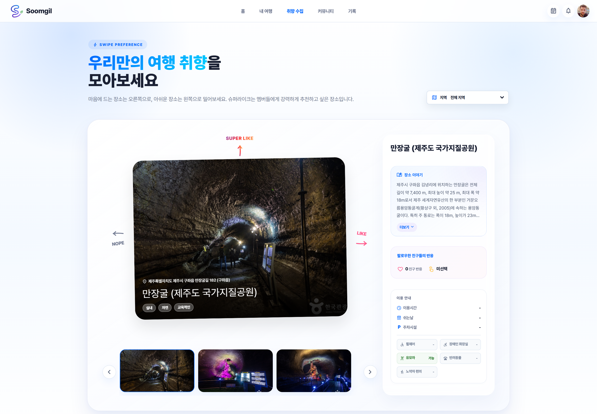
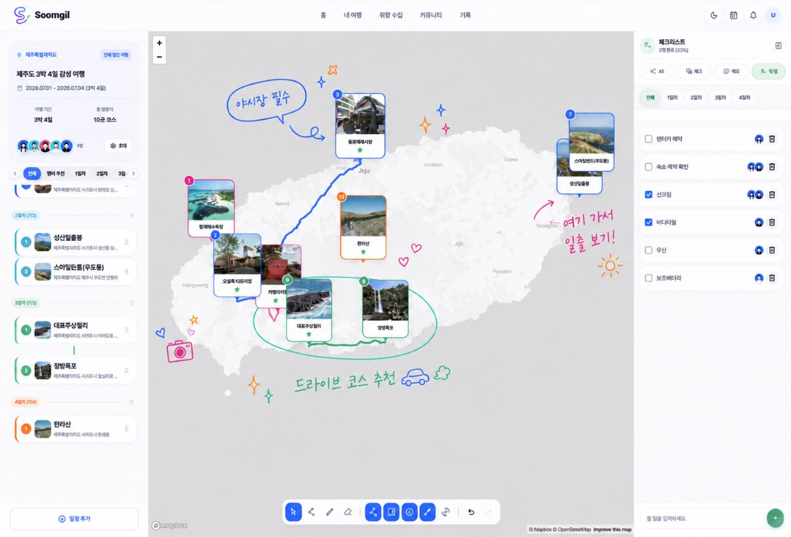
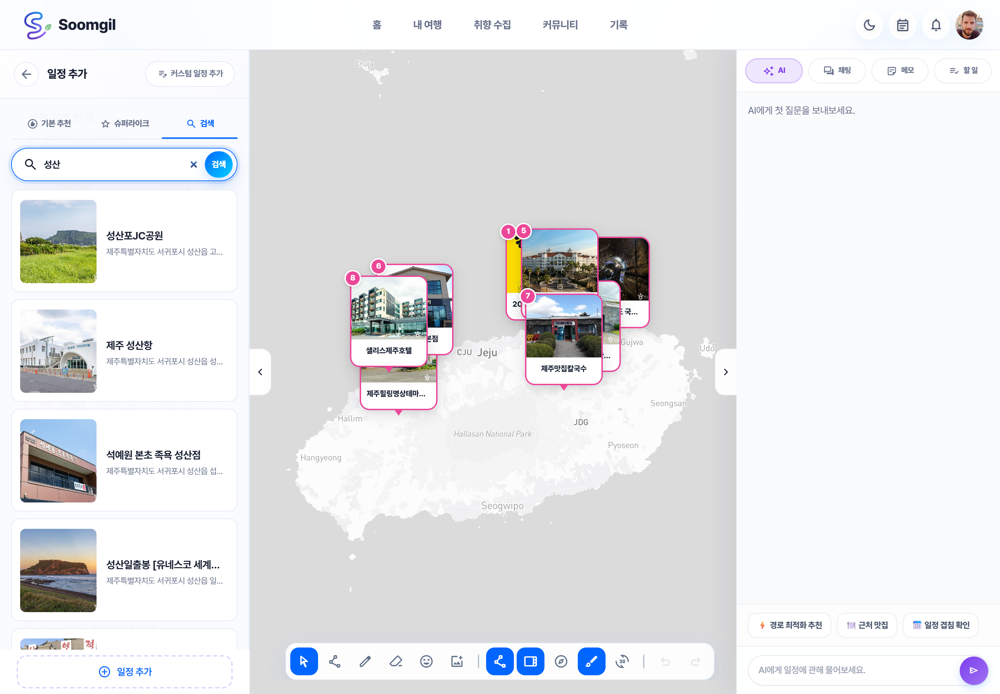
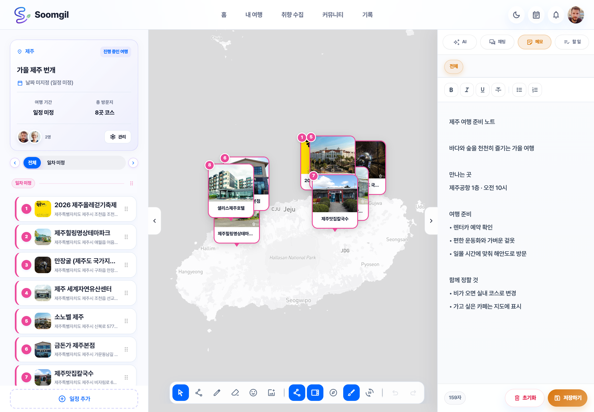
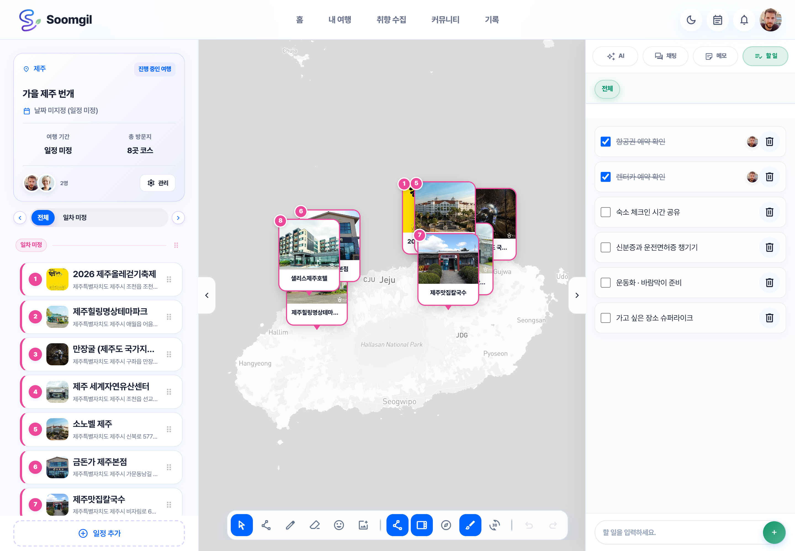
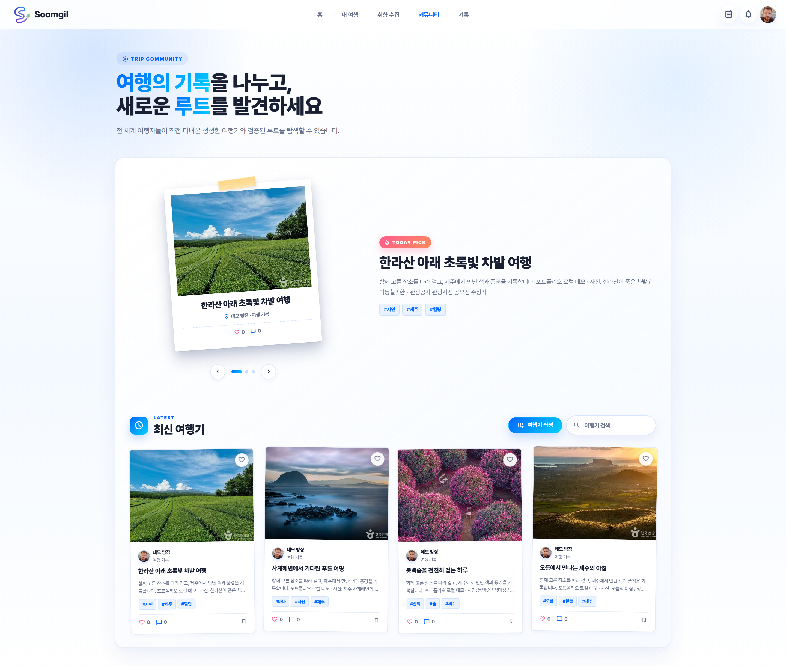
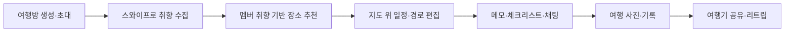
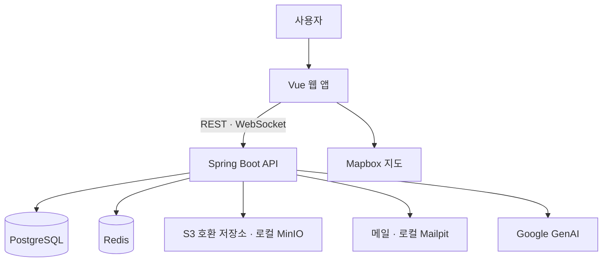

<p align="center">
  
</p>

<h1 align="center">숨길 · Soomgil</h1>

<p align="center">
  <strong>함께 그리는 설렘, 여행의 모든 순간</strong><br />
  스와이프로 취향을 모으고, 지도 위에서 함께 계획하는 그룹 여행 서비스입니다.
</p>

## 프로젝트 소개 📝

숨길은 여러 사람이 함께 가는 여행을 더 쉽게 정하는 서비스입니다. 각 사용자는 장소를 스와이프하며 취향을 남기고, 여행방에서는 멤버들의 선호를 바탕으로 갈 만한 장소를 추천받습니다. 추천된 장소는 지도 위 일정으로 바로 옮길 수 있고, 멤버들은 같은 여행방에서 경로, 메모, 체크리스트, 채팅을 함께 관리합니다.

숨길의 기본 사용 흐름은 다음과 같습니다.

1. 여행방을 만들고 멤버를 초대합니다.
2. 각자 장소를 스와이프해 취향 데이터를 쌓습니다.
3. 여행방 지도에서 멤버 취향 기반 장소를 추천받습니다.
4. 추천 장소를 일정에 추가하고 경로를 조정합니다.
5. 여행 중 기록을 남기고, 완성된 여행은 커뮤니티에 공유합니다.

### 주요 기능 화면

<table>
  <tbody>
    <tr>
      <td width="440" height="225" align="center" valign="middle"></td>
      <td width="440" height="225" align="center" valign="middle"></td>
    </tr>
    <tr>
      <td width="440" height="140" align="center" valign="top"><h4>스와이프로 취향 수집</h4><p><sub>장소를 좋아요·슈퍼라이크·패스로 평가하고,</sub><br /><sub>내 취향을 여행 추천에 반영합니다.</sub></p></td>
      <td width="440" height="140" align="center" valign="top"><h4>지도 위 공동 일정</h4><p><sub>장소와 경로를 연결하고 지도에 그림을 더해,</sub><br /><sub>함께 여행 동선을 구체화합니다.</sub></p></td>
    </tr>
    <tr>
      <td width="440" height="225" align="center" valign="middle"></td>
      <td width="440" height="225" align="center" valign="middle"></td>
    </tr>
    <tr>
      <td width="440" height="140" align="center" valign="top"><h4>장소 추천·탐색</h4><p><sub>지도 범위와 멤버 취향으로 장소를 찾고,</sub><br /><sub>가고 싶은 곳을 일정에 추가합니다.</sub></p></td>
      <td width="440" height="140" align="center" valign="top"><h4>여행방 공동 메모</h4><p><sub>일정을 보면서 준비 사항을 기록하고,</sub><br /><sub>같은 여행방에서 정보를 공유합니다.</sub></p></td>
    </tr>
    <tr>
      <td width="440" height="225" align="center" valign="middle"></td>
      <td width="440" height="225" align="center" valign="middle"></td>
    </tr>
    <tr>
      <td width="440" height="140" align="center" valign="top"><h4>준비물 체크리스트</h4><p><sub>할 일과 준비물을 정리하고,</sub><br /><sub>완료 상태를 함께 확인합니다.</sub></p></td>
      <td width="440" height="140" align="center" valign="top"><h4>여행기 커뮤니티</h4><p><sub>여행 사진과 기록을 공유하고,</sub><br /><sub>댓글·좋아요·리트립으로 여행을 이어갑니다.</sub></p></td>
    </tr>
  </tbody>
</table>

화면은 로컬 데모 캡처이며, 지도 손그림 화면은 기존 프로젝트 소개 자료에서 가져왔습니다. 메모·체크리스트·여행기 내용은 촬영용 예시입니다. 커뮤니티 사진은 한국관광공사 제공 공모전 수상작이며, 촬영자와 원본 링크는 [사진 출처](docs/assets/PHOTO-CREDITS.md), 화면별 출처는 [이미지 안내](docs/assets/README.md)에 정리했습니다.

### 주요 기능

| 기능 | 설명 |
| :--- | :--- |
| 여행방 | 멤버 초대, 여행 정보 관리, 역할 기반 접근 |
| 취향 수집 | 장소 스와이프와 슈퍼라이크 기반 선호도 학습 |
| 장소 추천 | 현재 지도 범위와 멤버 취향을 반영한 추천 |
| 지도 일정 | 일정 편집, 경로 연결, 지도 그림, 3D/테마 지도 보기 |
| 협업 도구 | 여행방 채팅, AI 가이드, 메모, 체크리스트 |
| 기록/커뮤니티 | 여행 사진 기록, 여행기 발행, 좋아요, 리트립 |

## 팀 구성 👥

| 이름 | GitHub | 구분 |
| :--- | :--- | :--- |
| 김지훈 | [@2hnK](https://github.com/2hnK) | 팀장 |
| 민경철 | [@kcrmin](https://github.com/kcrmin) | 팀원 |
| 윤정 | [@dbswjd0191a](https://github.com/dbswjd0191a) | 팀원 |

## 프로젝트 기술 스택 💡

### 프론트엔드


- **Vue · TypeScript · Vite**로 웹 앱을 구성하고, **Pinia · Vue Router**로 상태와 화면 이동을 관리합니다.
- **Mapbox GL JS**로 지도와 경로를 표시하며, **STOMP**로 여행방의 실시간 통신을 연결합니다.
- **Vitest · Vue Test Utils**로 프론트엔드 기능을 검증합니다.

### 백엔드


- **Java 21 · Spring Boot 3.5 · Spring Modulith** 기반으로 도메인을 구성하고, 명령과 조회의 역할을 분리합니다.
- **Spring Security · OAuth2**로 인증을, **MyBatis · Flyway**로 데이터 접근과 마이그레이션을 관리합니다.
- **Spring WebSocket**으로 협업 이벤트를 전달하고, **Spring AI · Google GenAI**로 AI 가이드를 연결합니다.
- **JUnit · Testcontainers**를 사용합니다.

### 데이터·로컬 인프라


**PostgreSQL**에 서비스 데이터를 저장하고, **Redis**를 캐시 등에 사용합니다. 로컬에서는 **MinIO**로 S3 호환 이미지 저장소를, **Mailpit**으로 메일 확인 환경을 구성합니다. 버전은 현재 서브모듈의 빌드 설정과 루트 Compose 구성을 기준으로 정리했습니다.

## 프로젝트 아키텍처 🏛

### 사용자 이용 흐름



### 서비스 구성

이 저장소는 `frontend`와 `backend` 서브모듈을 묶어 로컬 실행과 통합 관리를 담당하는 orchestration repo입니다.

| 경로 | 역할 |
| :--- | :--- |
| [frontend](https://github.com/Soomgil/soomgil-frontend) | Vue 기반 웹 앱 서브모듈 |
| [backend](https://github.com/Soomgil/soomgil-backend) | Spring Boot API 서버 서브모듈 |
| `.agent/` | AI 작업 문서, 계약, 하네스 |
| `.agent/workspaces.json` | 서브모듈·실행 명령 workspace 인벤토리 |
| `.agent/contracts/backend_contract_decisions.md` | 백엔드 계약 결정 기록 |
| `.agent/branch-ledger/` | 기능 브랜치별 AI 작업 문맥 |
| `compose.yaml` | 로컬 통합 실행 환경 |



위 구성도는 저장소의 애플리케이션 연결과 로컬 실행 구성을 요약합니다. 지도와 AI 등 외부 연동에는 별도 설정이 필요합니다.

## 빠른 실행 🚀

Docker Desktop이 필요합니다. 아래 Docker Compose 실행은 프론트엔드의 Node.js 환경도 컨테이너 안에서 준비합니다(`node:22-alpine`). 로컬에서 프론트엔드 개발·테스트나 실행 스크립트를 사용할 때는 **Node.js 22.12 이상인 22.x**를 권장합니다. 잠금 파일의 Vite 8·Vue 플러그인 요구 조건은 `^20.19.0 || >=22.12.0`이며, 하네스 자체 요구 조건은 Node.js 20 이상입니다.

```bash
git clone --recurse-submodules https://github.com/Soomgil/soomgil.git
cd soomgil
cp .env.example .env
docker compose --profile full up --build -d
```

이미 clone했다면 `git submodule update --init --recursive`로 제품 코드를 준비합니다. 환경변수는 [.env.example](.env.example)을 참고해 설정하세요. 지도에는 `MAPBOX_ACCESS_TOKEN`이 필요하며, AI·소셜 로그인 등 외부 연동도 해당 서비스 설정이 필요합니다.

접속 주소:

| 서비스 | 주소 |
| :--- | :--- |
| Frontend | http://localhost:5173 |
| Backend | http://localhost:8080 |
| Mailpit | http://localhost:8025 |
| MinIO Console | http://localhost:9001 |

로컬 `compose.yaml`은 `.env`에 AWS S3 값이 있더라도 파일 저장소를 MinIO로 고정합니다.
브라우저 직접 업로드 URL은 `http://localhost:9000`으로 서명되고, 백엔드는 Docker 내부 주소로 MinIO에 접근합니다.
AWS 배포 설정은 `compose.aws.yaml`과 `.env.aws`에서만 관리합니다.

### Gmail로 실제 인증 메일 보내기

Google 계정에서 2단계 인증과 앱 비밀번호를 설정한 뒤 루트 `.env`의 메일 항목을 다음처럼 지정합니다.

```properties
MAIL_HOST=smtp.gmail.com
MAIL_PORT=587
MAIL_USERNAME=your-account@gmail.com
MAIL_PASSWORD=your-google-app-password
MAIL_SMTP_AUTH=true
MAIL_SMTP_STARTTLS=true
MAIL_SMTP_STARTTLS_REQUIRED=true
MAIL_SMTP_SSL=false
MAIL_SMTP_SSL_TRUST=smtp.gmail.com
MAIL_SMTP_CHECK_SERVER_IDENTITY=true
```

`MAIL_PASSWORD`에는 Google 계정 비밀번호가 아닌 앱 비밀번호를 사용합니다. `MAIL_FROM`을 생략하면
`MAIL_USERNAME` 주소가 발신자로 사용됩니다. 실제 비밀번호가 든 `.env`는 커밋하지 않습니다.

중지:

```bash
docker compose --profile full down
```

## 자주 쓰는 명령

| 명령 | 설명 |
| :--- | :--- |
| `node start-soomgil.mjs both` | 프론트엔드와 백엔드 실행 |
| `node start-soomgil.mjs frontend` | 프론트엔드만 실행 |
| `node start-soomgil.mjs backend` | 백엔드와 필수 인프라 실행 |
| `node start-soomgil.mjs reset` | 로컬 데모 DB 초기화 |
| `node start-soomgil.mjs stop` | 전체 컨테이너 종료 |

Windows에서는 `start-soomgil.bat`, macOS에서는 `start-soomgil.command`를 사용할 수 있습니다.

## 개발 메모

- 실제 제품 코드는 각 서브모듈 repo에서 커밋합니다.
- 이 루트 repo는 서브모듈 포인터와 통합 실행 설정을 관리합니다.
- Git Flow와 서브모듈 운영 규칙은 `.agent/docs/process/git_workflow.md`를 따릅니다.
- 실제 환경변수 파일인 `.env`는 커밋하지 않습니다.

## 관련 문서 📚

- [기능 명세](.agent/docs/product-specs/functional_spec.md) · [서비스 요구사항](.agent/docs/product-specs/service_requirements.md)
- [아키텍처 가이드](.agent/docs/architecture/architecture_guide.md) · [API 명세](.agent/docs/api/api_spec.md)
- [Git Flow·서브모듈 운영 규칙](.agent/docs/process/git_workflow.md)
- [프론트엔드 실행 안내](https://github.com/Soomgil/soomgil-frontend#readme) · [백엔드 실행 안내](https://github.com/Soomgil/soomgil-backend#readme)
- [관광 데이터 출처 정책](.agent/docs/product-specs/tourism_source_policy.md) · [화면·이미지 출처](docs/assets/README.md)
- [워크스페이스 구성](.agent/workspaces.json) · [백엔드 계약 결정](.agent/contracts/backend_contract_decisions.md) · [브랜치 작업 기록](.agent/branch-ledger/)
- 제품 코드 경계: `frontend/`는 웹 앱, `backend/`는 API 서버 서브모듈입니다.
