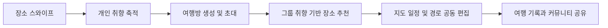
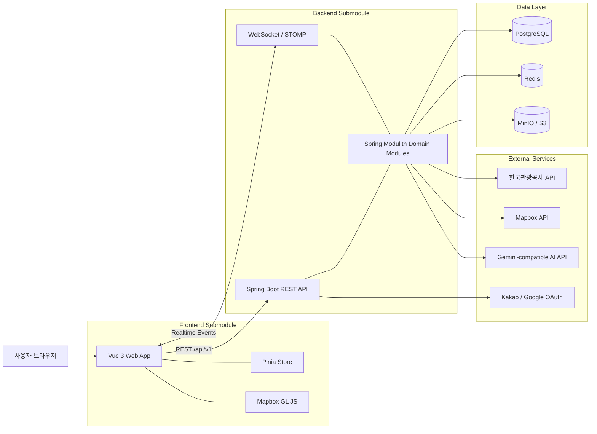
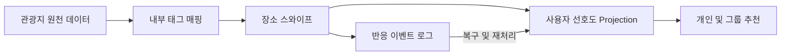

<div align="center">
  

  <h1>숨길 (Soomgil)</h1>

  <h3>스와이프로 취향을 모으고, 지도 위에서 함께 완성하는 그룹 여행 서비스</h3>

  <p>
    <strong>개발 인원</strong> 3명<br />
    <strong>플랫폼</strong> Web<br />
    <strong>저장소 구성</strong> Orchestration Repository · Frontend/Backend Submodules
  </p>
</div>

---

## 📑 목차

- [📌 서비스 소개](#service-introduction)
- [👥 팀원 소개 및 역할](#team)
- [✨ 주요 기능](#features)
- [🛠️ 기술 스택](#tech-stack)
- [🏗️ 시스템 아키텍처](#system-architecture)
- [🗄️ ERD](#erd)
- [📋 API 명세](#api-specification)
- [🔬 핵심 기술 상세](#core-technologies)

---

<a id="service-introduction"></a>

## 📌 서비스 소개

숨길은 여러 사람이 함께 떠나는 여행에서 **각자의 취향을 일일이 묻고 조율해야 하는 불편함**을 줄이기 위해 만든 협업 여행 설계 서비스입니다.

사용자는 평소 관심 있는 장소를 `LIKE`, `NOPE`, `SUPER LIKE`로 평가하며 자신의 여행 취향을 쌓습니다. 여행방을 만들면 멤버들의 누적 취향을 바탕으로 함께 좋아할 만한 장소를 추천받고, 추천 결과를 지도 위 일정에 바로 추가할 수 있습니다.

여행방에서는 경로, 메모, 체크리스트와 채팅을 함께 관리할 수 있습니다. 여행이 끝난 뒤에는 사진과 일정을 여행기로 남기고, 다른 사용자의 여행을 내 여행으로 가져와 새로운 계획을 시작할 수 있습니다.

### 기획 배경

그룹 여행을 계획할 때는 다음과 같은 문제가 반복됩니다.

- 각자가 좋아하는 장소를 단체 채팅에서 다시 물어봐야 합니다.
- 검색한 장소와 실제 일정이 여러 앱과 메시지에 흩어집니다.
- 여러 사람이 일정을 동시에 수정하면 최신 계획을 파악하기 어렵습니다.
- 여행이 끝난 뒤 사진과 경로가 분리되어 온전한 기록으로 남지 않습니다.

숨길은 **취향 수집 → 그룹 추천 → 공동 일정 설계 → 여행 기록**을 하나의 흐름으로 연결합니다.

### 대상 사용자

| 사용자 | 제공 가치 |
| :--- | :--- |
| 여행방 방장 | 여행방을 만들고 멤버를 초대해 공동 일정을 관리합니다. |
| 여행방 멤버 | 장소에 대한 취향을 표현하고 추천 장소와 일정 편집에 참여합니다. |
| 여행 기록 작성자 | 여행 중 남긴 사진과 경로를 하나의 여행기로 정리합니다. |
| 커뮤니티 탐색자 | 다른 여행자의 일정과 후기를 살펴보고 새로운 여행으로 가져옵니다. |

### 핵심 가치

1. **말하지 않아도 쌓이는 여행 취향**<br />
   평소의 장소 스와이프 반응을 통해 사용자의 선호를 지속적으로 학습합니다.

2. **개인 취향을 그룹의 선택으로 연결**<br />
   여행방 멤버들의 취향을 함께 반영해 모두가 만족할 가능성이 높은 장소를 보여줍니다.

3. **발견에서 일정까지 끊기지 않는 흐름**<br />
   추천 장소를 현재 보고 있는 지도와 일정에 곧바로 추가하고 경로를 조정할 수 있습니다.

4. **계획부터 기록까지 이어지는 여행 경험**<br />
   함께 만든 일정과 여행 중의 사진을 여행기로 남기고 다른 사용자와 공유할 수 있습니다.

### 기본 사용 흐름



---

<a id="team"></a>

## 👥 팀원 소개 및 역할

<table>ㅇ
  <tr>
    <td align="center" width="33%" valign="top">
      <!-- 프로필 사진 추가 시 아래 안내 문구를 이미지 태그로 교체합니다.
      
      -->
      <strong>프로필 사진</strong><br />
      <sub>1:1 비율 · 160px 이상 권장</sub><br /><br />
      <strong>윤정</strong><br />
      Full-stack<br /><br />
      <sub>Web Frontend · Spring Boot Backend · 통합 개발</sub>
    </td>
    <td align="center" width="33%" valign="top">
      <!-- 프로필 사진 추가 시 아래 안내 문구를 이미지 태그로 교체합니다.
      
      -->
      <strong>프로필 사진</strong><br />
      <sub>1:1 비율 · 160px 이상 권장</sub><br /><br />
      <strong>민경철</strong><br />
      Full-stack<br /><br />
      <sub>Web Frontend · Spring Boot Backend · 통합 개발</sub>
    </td>
    <td align="center" width="33%" valign="top">
      <!-- 프로필 사진 추가 시 아래 안내 문구를 이미지 태그로 교체합니다.
      
      -->
      <strong>프로필 사진</strong><br />
      <sub>1:1 비율 · 160px 이상 권장</sub><br /><br />
      <strong>김지훈</strong><br />
      Full-stack<br /><br />
      <sub>Web Frontend · Spring Boot Backend · 통합 개발</sub>
    </td>
  </tr>
</table>

---

<a id="features"></a>

## ✨ 주요 기능

| 기능 | 설명 |
| :--- | :--- |
| 🏠 여행방 | 여행 정보를 설정하고 멤버를 초대해 하나의 여행 계획을 공유합니다. |
| 💳 취향 스와이프 | 장소 카드에 `LIKE`, `NOPE`, `SUPER LIKE`로 반응해 개인 취향 데이터를 쌓습니다. |
| 🎯 그룹 장소 추천 | 현재 지도 범위와 여행방 멤버들의 취향을 반영해 일정에 추가할 장소를 추천합니다. |
| 🗺️ 지도 일정 | 장소를 일차별로 배치하고 순서, 경로와 지도 그림을 함께 편집합니다. |
| ✏️ 스케치 경로 | 지도에 그린 선을 실제 이동 가능한 도로 경로로 보정합니다. |
| 💬 실시간 협업 | 여행방 채팅, 메모, 체크리스트와 일정 변경 내용을 멤버들과 공유합니다. |
| 🤖 AI 여행 가이드 | 여행방의 일정과 장소 문맥을 바탕으로 질문에 답하고 제한된 계획 작업을 돕습니다. |
| 📸 여행 기록 | 여행방과 연결된 사진과 메모를 모아 여행의 순간을 기록합니다. |
| 🌐 커뮤니티 | 완성된 여행을 게시하고 좋아요, 댓글과 리트립으로 다른 여행자와 교류합니다. |

### 1. 취향을 쌓는 장소 스와이프

<table>
  <tr>
    <td width="55%" align="center" valign="middle">
      <!-- 기능 이미지 추가 시 아래 안내 문구를 이미지 태그로 교체합니다.
      
      -->
      <strong>기능 화면 이미지</strong><br />
      <sub>GIF 또는 PNG · 16:9 권장</sub>
    </td>
    <td width="45%" valign="top">
      <strong>취향을 쌓는 장소 스와이프</strong><br /><br />
      <ul>
        <li>여행지를 먼저 정하지 않아도 전역 장소 피드에서 취향을 쌓을 수 있습니다.</li>
        <li><code>SUPER LIKE</code>는 꼭 가고 싶은 장소에 대한 강한 선호로 반영됩니다.</li>
        <li>이미 반응한 장소도 정보나 태그가 바뀌면 다시 평가할 수 있습니다.</li>
        <li>팔로우한 사용자의 반응은 세부 점수 대신 제한된 프로필 정보로만 표시합니다.</li>
      </ul>
    </td>
  </tr>
</table>

### 2. 그룹 취향 기반 장소 추천

<table>
  <tr>
    <td width="55%" align="center" valign="middle">
      <!-- 기능 이미지 추가 시 아래 안내 문구를 이미지 태그로 교체합니다.
      
      -->
      <strong>기능 화면 이미지</strong><br />
      <sub>GIF 또는 PNG · 16:9 권장</sub>
    </td>
    <td width="45%" valign="top">
      <strong>그룹 취향 기반 장소 추천</strong><br /><br />
      <ul>
        <li>여행방 멤버들의 누적 스와이프 데이터를 함께 반영합니다.</li>
        <li>현재 지도 화면 안에 있는 장소를 중심으로 추천해 곧바로 일정에 추가할 수 있습니다.</li>
        <li>태그 일치도를 중심으로 정렬하고 거리를 보조 기준으로 사용합니다.</li>
        <li>세부 선호 점수는 숨기고 해당 장소와 잘 맞는 멤버만 가볍게 보여줍니다.</li>
      </ul>
    </td>
  </tr>
</table>

### 3. 지도 위 공동 일정 설계

<table>
  <tr>
    <td width="55%" align="center" valign="middle">
      <!-- 기능 이미지 추가 시 아래 안내 문구를 이미지 태그로 교체합니다.
      
      -->
      <strong>기능 화면 이미지</strong><br />
      <sub>GIF 또는 PNG · 16:9 권장</sub>
    </td>
    <td width="45%" valign="top">
      <strong>지도 위 공동 일정 설계</strong><br /><br />
      <ul>
        <li>장소를 일차별 일정 또는 <code>일차 미정</code> 그룹에 배치할 수 있습니다.</li>
        <li>일정 순서를 바꾸고 장소 사이의 이동 경로를 연결할 수 있습니다.</li>
        <li>지도 위에 직접 선이나 도형을 그려 계획을 시각적으로 공유할 수 있습니다.</li>
        <li>드로잉한 경로는 Mapbox Map Matching을 이용해 실제 도로에 맞게 보정합니다.</li>
      </ul>
    </td>
  </tr>
</table>

### 4. 여행방 협업 도구

<table>
  <tr>
    <td width="55%" align="center" valign="middle">
      <!-- 기능 이미지 추가 시 아래 안내 문구를 이미지 태그로 교체합니다.
      
      -->
      <strong>기능 화면 이미지</strong><br />
      <sub>GIF 또는 PNG · 16:9 권장</sub>
    </td>
    <td width="45%" valign="top">
      <strong>여행방 협업 도구</strong><br /><br />
      <ul>
        <li>여행방 멤버끼리 채팅하고 메모와 체크리스트를 공동으로 관리합니다.</li>
        <li>일정과 지도 변경 사항은 WebSocket/STOMP 이벤트를 통해 동기화됩니다.</li>
        <li>사용자별 활성 협업 세션에서 최근 변경에 대한 undo/redo를 지원합니다.</li>
        <li>AI 가이드는 여행방 상태를 참고하되 허용된 도구와 권한 안에서만 작업합니다.</li>
      </ul>
    </td>
  </tr>
</table>

### 5. 여행 기록과 커뮤니티

<table>
  <tr>
    <td width="55%" align="center" valign="middle">
      <!-- 기능 이미지 추가 시 아래 안내 문구를 이미지 태그로 교체합니다.
      
      -->
      <strong>기능 화면 이미지</strong><br />
      <sub>GIF 또는 PNG · 16:9 권장</sub>
    </td>
    <td width="45%" valign="top">
      <strong>여행 기록과 커뮤니티</strong><br /><br />
      <ul>
        <li>여행방, 일차와 장소에 연결된 사진 및 메모를 기록합니다.</li>
        <li>완성한 여행은 일정과 경로의 게시 시점 스냅샷으로 공유합니다.</li>
        <li>게시글에 좋아요와 댓글을 남기고 다른 사용자를 팔로우할 수 있습니다.</li>
        <li><code>리트립</code>으로 공개 일정을 새로운 내 여행으로 가져올 수 있습니다.</li>
      </ul>
    </td>
  </tr>
</table>

---

<a id="tech-stack"></a>

## 🛠️ 기술 스택

<table>
  <tr>
    <th width="18%">분류</th>
    <th>기술</th>
  </tr>
  <tr>
    <td><strong>Frontend</strong></td>
    <td>
      
      
      
      
      
      
      
      
      
    </td>
  </tr>
  <tr>
    <td><strong>Backend</strong></td>
    <td>
      
      
      
      
      
      
      
      
    </td>
  </tr>
  <tr>
    <td><strong>Data</strong></td>
    <td>
      
      
      
    </td>
  </tr>
  <tr>
    <td><strong>Infrastructure</strong></td>
    <td>
      
      
      
      
    </td>
  </tr>
  <tr>
    <td><strong>External API</strong></td>
    <td>
      
      
      
      
      
    </td>
  </tr>
  <tr>
    <td><strong>Test</strong></td>
    <td>
      
      
      
      
    </td>
  </tr>
</table>

---

<a id="system-architecture"></a>

## 🏗️ 시스템 아키텍처



숨길의 루트 저장소는 제품 코드를 직접 담는 단일 애플리케이션이 아니라, `frontend`와 `backend` 저장소를 서브모듈로 연결하고 통합 실행 환경과 계약 문서를 관리하는 orchestration repository입니다.

---

<a id="erd"></a>

## 🗄️ ERD

숨길의 데이터 모델은 PostgreSQL을 기준으로 인증, 여행방, 일정, 장소, 취향, 기록과 커뮤니티 영역을 분리합니다. 테이블은 `auth.users`, `trip.trips`와 같이 schema-qualified name을 사용해 모듈의 경계를 표현합니다.

- [DBML 스키마](./.agent/contracts/schema.dbml)
- [백엔드 계약 결정](./.agent/contracts/backend_contract_decisions.md)

<!-- 실제 ERD 이미지가 준비되면 이 위치에 추가합니다.
권장 경로: .agent/docs/readme-assets/erd/soomgil-erd.png
-->

---

<a id="api-specification"></a>

## 📋 API 명세

모든 REST API는 `/api/v1`을 기본 경로로 사용합니다. 인증, 여행방, 장소와 선호도, 일정, 협업, 채팅, 기록 및 커뮤니티 기능의 계약을 OpenAPI 3.1로 관리합니다.

- [OpenAPI 3.1 계약](./.agent/contracts/openapi.yaml)
- [API 상세 명세](./.agent/docs/api/api_spec.md)
- 로컬 Swagger UI: `http://localhost:8080/swagger-ui`

주요 API 영역:

| 영역 | 대표 경로 |
| :--- | :--- |
| Auth / User | `/api/v1/auth/**`, `/api/v1/me/**` |
| Trip | `/api/v1/trips/**`, `/api/v1/trip-invites/**` |
| Place / Swipe | `/api/v1/places/**`, `/api/v1/swipe/**` |
| Recommendation | `/api/v1/trips/{tripId}/place-recommendations` |
| Itinerary / Route | `/api/v1/trips/{tripId}/itinerary/**`, `/api/v1/trips/{tripId}/routes/**` |
| Collaboration | `/api/v1/trips/{tripId}/collaboration/**` |
| Chat / AI | `/api/v1/trips/{tripId}/chat/**`, `/api/v1/trips/{tripId}/ai/**` |
| Record / Community | `/api/v1/trips/{tripId}/records/**`, `/api/v1/community/**` |

---

<a id="core-technologies"></a>

## 🔬 핵심 기술 상세

### 1. 스와이프 이벤트 기반 취향 프로필

장소 반응의 최종 상태와 변경 이력을 함께 관리합니다. `LIKE`, `NOPE`, `SUPER LIKE` 이벤트에서 장소별 내부 태그 근거를 계산하고, 사용자별 태그 선호도를 조회하기 쉬운 projection으로 갱신합니다.



추천 요청마다 전체 이벤트를 다시 계산하지 않고 현재 projection을 사용해 응답 속도를 확보합니다. 태그 정책이나 원천 정보가 바뀌었을 때는 이벤트 로그를 기반으로 선호도를 재구성할 수 있습니다.

### 2. 지도 범위와 그룹 취향을 결합한 추천

추천 후보는 사용자가 현재 보고 있는 지도 viewport를 기준으로 제한합니다. 각 장소의 태그와 여행방 멤버들의 선호도를 결합해 매칭 점수를 계산하고, 거리는 보조 점수 또는 동점 기준으로 사용합니다.

다른 멤버의 원본 반응, 세부 태그와 점수는 API로 노출하지 않습니다. 프론트엔드에는 해당 장소와 잘 맞는 멤버의 제한된 프로필 정보만 전달해 추천 근거와 취향 프라이버시를 함께 지킵니다.

### 3. 스케치를 실제 도로로 바꾸는 경로 설계

사용자가 지도 위에 그린 stroke 좌표를 단순화한 뒤 Mapbox Map Matching API로 전달합니다. 보정된 경로는 출발 일정과 도착 일정 사이의 route segment로 저장하며, 보정에 실패한 임시 stroke는 영구 저장하지 않습니다.

이 구조를 통해 자유롭게 그리는 계획 경험과 실제 이동 가능한 도로 경로를 하나의 편집 흐름으로 연결합니다.

### 4. 버전 기반 실시간 협업과 undo/redo

일정, 경로, 지도 그림, 메모와 체크리스트 변경을 협업 command로 처리합니다. 변경이 완료되면 version을 증가시키고 STOMP topic으로 이벤트를 발행해 같은 여행방의 화면을 갱신합니다.

undo/redo는 데이터베이스 트랜잭션 자체를 되돌리는 방식이 아니라, 사용자별 WebSocket 세션에서 이전 작업의 보상 command를 실행하는 방식입니다. 다른 사용자의 최신 변경과 충돌하면 자동 실행을 거절해 협업 데이터의 정합성을 보호합니다.

### 5. 여행 스냅샷 기반 커뮤니티와 리트립

여행기를 발행할 때 일정, 장소와 경로를 게시 시점의 snapshot으로 저장합니다. 원본 여행방의 계획이 나중에 바뀌어도 공개한 여행기는 그대로 유지됩니다.

리트립은 공개된 snapshot을 기존 여행에 섞지 않고 새로운 여행방으로 복제합니다. 사용자는 다른 여행자의 경험을 출발점으로 삼되 자신의 일정으로 독립적으로 수정할 수 있습니다.

---

<details>
<summary><strong>🚀 개발자 가이드 (빌드·실행)</strong></summary>

<br />

### 사전 준비

| 도구 | 용도 |
| :--- | :--- |
| Git | 루트 저장소와 서브모듈 clone |
| Docker Desktop | PostgreSQL, Redis, MinIO와 전체 애플리케이션 실행 |
| Node.js 20.19+ 또는 22.12+ | 통합 실행 스크립트와 Frontend 개발 |
| Java 21 | Backend를 로컬 프로세스로 실행할 때 필요 |

지도, AI, 관광 정보와 소셜 로그인 기능을 사용하려면 `.env.example`에 안내된 각 외부 서비스의 API key 또는 OAuth credential이 필요합니다. 실제 비밀값이 들어 있는 `.env`는 커밋하지 않습니다.

### 저장소 받기

```bash
git clone --recurse-submodules https://github.com/Soomgil/soomgil.git
cd soomgil
```

이미 루트 저장소만 clone했다면 서브모듈을 초기화합니다.

```bash
git submodule update --init --recursive
```

### 환경변수 준비

macOS / Linux:

```bash
cp .env.example .env
```

Windows PowerShell:

```powershell
Copy-Item .env.example .env
```

### Docker Compose로 전체 실행

```bash
docker compose --profile full up --build -d
```

| 서비스 | 주소 |
| :--- | :--- |
| Frontend | `http://localhost:5173` |
| Backend API | `http://localhost:8080` |
| Swagger UI | `http://localhost:8080/swagger-ui` |
| Mailpit | `http://localhost:8025` |
| MinIO Console | `http://localhost:9001` |

종료:

```bash
docker compose --profile full down
```

### 통합 실행 스크립트

```text
node start-soomgil.mjs both       # Frontend와 Backend 실행
node start-soomgil.mjs frontend   # Frontend만 실행
node start-soomgil.mjs backend    # Backend와 필수 인프라 실행
node start-soomgil.mjs reset      # 로컬 데모 DB 삭제 후 초기화
node start-soomgil.mjs stop       # 전체 컨테이너 종료
```

> `reset`은 `.env`의 `DB_NAME`에 해당하는 로컬 데이터베이스를 삭제하고 데모 데이터를 다시 적재합니다.

Windows에서는 `start-soomgil.bat`, macOS에서는 `start-soomgil.command`를 사용할 수 있습니다.

### 서비스별 검증

Frontend:

```bash
cd frontend
npm ci
npm run build
npm run test:run
```

Backend — Windows PowerShell:

```powershell
cd backend
.\gradlew.bat test
```

Backend — macOS / Linux:

```bash
cd backend
./gradlew test
```

Orchestration harness:

```bash
npm --prefix .agent run harness:check
```

</details>

<details>
<summary><strong>📁 저장소 구조</strong></summary>

<br />

```text
soomgil/
├─ frontend/                       # Vue 3 Web App submodule
│  ├─ src/pages/                   # 라우트 단위 화면
│  ├─ src/components/              # 재사용 UI
│  ├─ src/api/                     # Backend API client
│  ├─ src/stores/                  # Pinia 상태
│  └─ src/styles/                  # 전역 스타일
├─ backend/                        # Spring Boot API submodule
│  ├─ src/main/java/com/soomgil/   # 도메인 모듈
│  └─ src/main/resources/
│     └─ db/migration/             # Flyway migration
├─ .agent/
│  ├─ contracts/                   # OpenAPI, DBML과 Backend 계약
│  ├─ docs/                        # 제품, 아키텍처와 개발 정책
│  └─ tools/                       # 인벤토리와 하네스 검사 도구
├─ compose.yaml                    # 로컬 통합 실행 환경
├─ .env.example                    # 환경변수 예시
├─ start-soomgil.mjs               # 통합 실행 스크립트
└─ README.md
```

`frontend/`와 `backend/`는 각각 독립된 Git 저장소이며 루트 저장소에는 submodule로 연결됩니다. 제품 코드는 각 submodule에서 관리하고, 루트 저장소는 submodule commit pointer, 통합 실행 설정과 공통 계약을 관리합니다.

</details>

<details>
<summary><strong>🌿 협업 규칙 — 브랜치 전략 & 커밋 컨벤션</strong></summary>

<br />

### 브랜치 전략

| 브랜치 | 용도 |
| :--- | :--- |
| `main` | 배포 가능한 production 기준 |
| `develop` | 다음 릴리스의 통합 기준 |
| `feature/*` | 기능 개발 |
| `bugfix/*` | 개발 중 버그 수정 |
| `release/*` | 릴리스 안정화 |
| `hotfix/*` | 운영 버전 긴급 수정 |

### 커밋 컨벤션

```text
<type>(<scope>): <summary>
```

예시:

```text
feat(frontend): add route drawing toolbar
feat(preference): add group place recommendation
fix(itinerary): reject stale collaboration version
docs(readme): document local development flow
chore(submodules): update frontend pointer
```

자세한 규칙은 [Git 운영 정책](./.agent/docs/process/git_workflow.md)을 따릅니다.

</details>

<!--
README 최종 반영 전 확인할 자료
- 개발 기간
- 배포 주소
- 발표 자료 및 시연 영상 링크
- 팀원별 GitHub 계정과 세부 담당 기능
- 주요 기능별 실제 화면 캡처 또는 GIF
- 최종 배포 구조를 반영한 시스템 아키텍처 이미지
- 최종 ERD 렌더 이미지
-->
